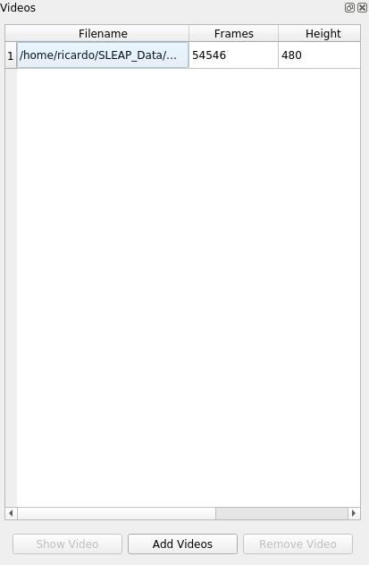
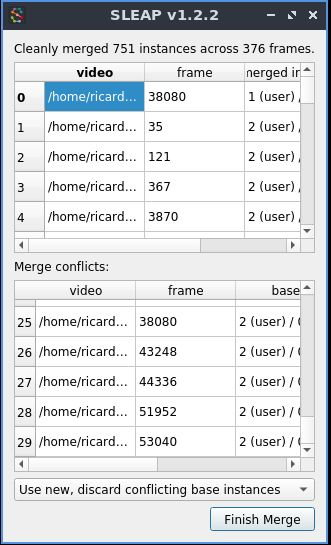

# Setting a project

## Activating the environment

In your command line (assuming you installed SLEAP through the [conda package](https://github.com/rdiazrincon/SLEAP_workshop/blob/master/Instructions.md#from-a-conda-package-recommended-method)), run:

~~~
conda activate sleap
~~~

If the SLEAP env is in a different path, navigate there and the activate it.

## Starting SLEAP

To open the GUI, once the environment is activated, run:
~~~
sleap-label
~~~

## Creating a new project

Inside SLEAP, go to File -> New Project. Alternatively you can hit Ctrl + N

Locate the "Videos" tab (in the bootom) and then click on "Add Video". Locate the path and then click "Open". Finally, click on "Import". Once you have added your video it should look something like this:

## Creating a skeleton

Locate the "Skeleton" tab (in the bottom) and click in "New Node". Each node will be a body part; you don't need to create body parts for all the animals in your videos i.e: m1_head, m2_head ... mn_head just the body part itself (head, thorax, etc). 

Create the following bodyparts: 

* left_ear*
* right_ear
* nose
* tail_base 
* thorax 
* forehead. 

Alternatively you can download them from [here](https://github.com/rdiazrincon/SLEAP_workshop/blob/master/examples/skeleton_1.json) and [here](https://github.com/rdiazrincon/SLEAP_workshop/blob/master/examples/skeleton_2.json).

Now let's connect those bodyparts! To create edges, select a bodypart from the "Edges" section and then "join them" by selecting another body part from the "to" part. That will create a line from bodypart_A to bodypart_B.

Connect the following bodyparts:

* nose -> forehead
* forehead -> left_ear
* forehead -> right_ear
* left_ear -> thorax
* right_ear -> thorax
* thorax -> tail_base

Save the skeleton. At the end it should look something like this:

# Labeling

## Selecting frames to label

Go to the "Labeling Suggestions" tab and select one of the four methods. Each method has a different criteria to generate labels. You can read more about the methods [here](https://sleap.ai/guides/gui.html#suggestion-methods).

Once you have selected a method click on "Generate suggestions" (this can take some ). That will create a list of different frames to label and will populate the top part of the "Labeling Suggestions" tab.

Depending on the method you chose, you could have a higher or lesser number or frames. Regardless, it should look more or less like this:

Tip: After running different methods, you can go to the next labeled frame by pressing "Alt" +  "Right Key"

## Creating Instances

Once you have a set of frames, create an instance for each animal in your video. To do this, go to the "Instances tab" and click on "New Instance".

Once your instance is created, locate each of the bodyparts where they belong. Tip: If the parts are occluded, try your best guess to estimate the position on the current frame.

Once it is created, select the Track, go to the "Tracks" menu and then to "Set Instance Track" -> "New Track" to assign a new name to them i.e: Mouse_1, Mouse_2, etc.

## More Labels

Now you have your first labeled frame. To label subsequent frames, go back to the "Labeling suggestions tab", hit "Next" and create new instances for the set of frames. Repeat until you have finished labeling the suggested frames.

You can copy the position of the prior labeled frame by going into the GUI, hiting the right click and then selecting "Copy from prior Frame".

If you mistakenly swapped the instances of the animals in the frame, you can it Ctrl + T to correct this.

## More Frames

Once you are done labeling the first set, go back to the "Labeling suggeestions" tab and select a different suggestion method.

When you are done, go to "Predict" -> "Export Labels Package" -> "Labeled + suggested frames" and save the .pkg.slp file. We will use this file later to run Training and Inference.

## Importing more Frames

Suppose you have labeled data and/or predictions and you want to increase the number of labeled frames. What you can do is merge the date from one file into another. To do this, go to "File" -> "Merge into project" and then select the .slp of .pkg.slp file where your data is located. 

After that, if you have merge conflicts you can either use the new instances or base instances for your project.

# Training and Inference

## Training via Colab and remote server

Please refer to this [Colab Notebok](https://github.com/rdiazrincon/SLEAP_workshop/blob/master/Training_and_inference.ipynb) and follow the instructions there.

# Proofreading

When you finish running training and inference you might encounter some errors:

## Swapped Idenitities

If you have swapped identities, please press "Ctrl" + "T" or go to "Tracks" -> "Transpose Identity Tracks"

## Mistaken Tracks/Instances

If you run into mistaken tracks you can try out the following.

* Identify the problematic instance.

* Go to "Tracks" -> "Set Instance Track" and then select the correct instance.

* If that steps above don't work, try deleting the instance and then adding a new one.