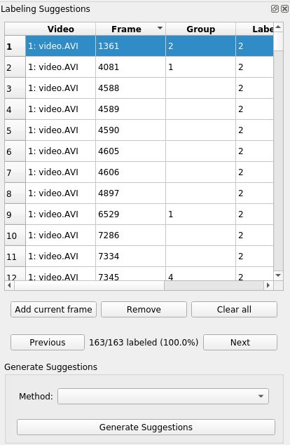

# Setting a project

## Activating the environment

In your command line (assuming you installed SLEAP through the [conda package](https://github.com/rdiazrincon/SLEAP_workshop/blob/master/Instructions.md#from-a-conda-package-recommended-method)), run:

~~~
conda activate sleap
~~~

If the SLEAP env is in a different path, navigate there and the activate it.

## Starting SLEAP

To open the GUI, once the environment is activated, run:
~~~
sleap-label
~~~

## Creating a new project

Inside SLEAP, go to File -> New Project. Alternatively you can hit Ctrl + N

Locate the "Videos" tab (in the bootom) and then click on "Add Video". Locate the path and then click "Open". Finally, click on "Import". Once you have added your video it should look something like this:

## Creating a skeleton

Locate the "Skeleton" tab (in the bottom) and click in "New Node". Each node will be a body part; you don't need to create body parts for all the animals in your videos i.e: m1_head, m2_head ... mn_head just the body part itself (head, thorax, etc). 

Create the following bodyparts: 

* left_ear*
* right_ear
* nose
* tail_base 
* thorax 
* forehead. 

Alternatively you can download them from [here](https://github.com/rdiazrincon/SLEAP_Data/blob/master/skeletons/skeleton_instances.json).

Now let's connect those bodyparts! To create edges, select a bodypart from the "Edges" section and then "join them" by selecting another body part from the "to" part. That will create a line from bodypart_A to bodypart_B.

Connect the following bodyparts:

* nose -> forehead
* forehead -> left_ear
* forehead -> right_ear
* left_ear -> thorax
* right_ear -> thorax
* thorax -> tail_base

Save the skeleton. At the end it should look something like this:

# Labeling

## Selecting frames to label

Go to the "Labeling Suggestions" tab and select one of the four methods. Each method has a different criteria to generate labels. You can read more about the methods [here](https://sleap.ai/guides/gui.html#suggestion-methods).

Once you have selected a method click on "Generate suggestions". That will create a list of different frames to label and will populate the top part of the "Labeling Suggestions" tab.

Depending on the method you chose, you could have a higher or lesser number or frames. Regardless, it should look more or less like this:

## Creating Instances

Once you have a set of frames, create an instance for each animal in your video. To do this, go to the "Instances tab" and click on "New Instance". 

Once it is created, in the "Track" part, assign a new name to it i.e: Mouse_1, Mouse_2, etc.

